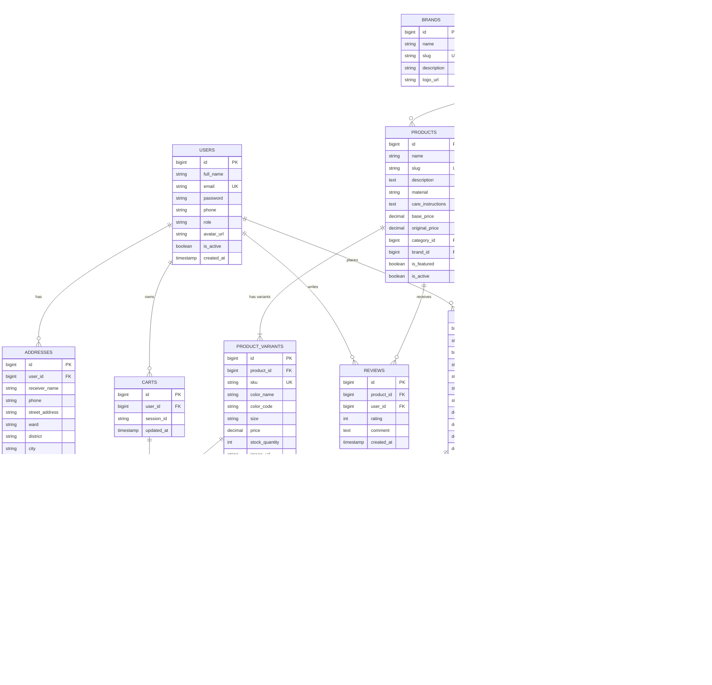

# SƠ ĐỒ THỰC THỂ QUAN HỆ CƠ SỞ DỮ LIỆU (DATABASE ERD)

## 1. Sơ đồ Mermaid ERD

```mermaid
erDiagram
    USERS ||--o{ ADDRESSES : "has"
    USERS ||--o{ CARTS : "owns"
    USERS ||--o{ ORDERS : "places"
    USERS ||--o{ REVIEWS : "writes"

    CATEGORIES ||--o{ CATEGORIES : "sub-categories"
    CATEGORIES ||--o{ PRODUCTS : "contains"
    BRANDS ||--o{ PRODUCTS : "produces"

    PRODUCTS ||--|{ PRODUCT_VARIANTS : "has variants"
    PRODUCTS ||--o{ PRODUCT_IMAGES : "has images"
    PRODUCTS ||--o{ REVIEWS : "receives"

    PRODUCT_VARIANTS ||--o{ CART_ITEMS : "added to"
    PRODUCT_VARIANTS ||--o{ ORDER_ITEMS : "ordered in"

    CARTS ||--o{ CART_ITEMS : "contains"

    ORDERS ||--|{ ORDER_ITEMS : "includes"
    ORDERS ||--|| PAYMENTS : "paid via"

    COUPONS ||--o{ ORDERS : "applied to"

    USERS {
        bigint id PK
        string full_name
        string email UK
        string password
        string phone
        string role
        string avatar_url
        boolean is_active
        timestamp created_at
    }

    ADDRESSES {
        bigint id PK
        bigint user_id FK
        string receiver_name
        string phone
        string street_address
        string ward
        string district
        string city
        boolean is_default
    }

    CATEGORIES {
        bigint id PK
        string name
        string slug UK
        string description
        string image_url
        bigint parent_id FK
        int display_order
    }

    BRANDS {
        bigint id PK
        string name
        string slug UK
        string description
        string logo_url
    }

    PRODUCTS {
        bigint id PK
        string name
        string slug UK
        text description
        string material
        text care_instructions
        decimal base_price
        decimal original_price
        bigint category_id FK
        bigint brand_id FK
        boolean is_featured
        boolean is_active
    }

    PRODUCT_VARIANTS {
        bigint id PK
        bigint product_id FK
        string sku UK
        string color_name
        string color_code
        string size
        decimal price
        int stock_quantity
        string image_url
        boolean is_active
    }

    PRODUCT_IMAGES {
        bigint id PK
        bigint product_id FK
        string image_url
        string color_name
        boolean is_primary
        int display_order
    }

    CARTS {
        bigint id PK
        bigint user_id FK
        string session_id
        timestamp updated_at
    }

    CART_ITEMS {
        bigint id PK
        bigint cart_id FK
        bigint variant_id FK
        int quantity
    }

    COUPONS {
        bigint id PK
        string code UK
        string discount_type
        decimal discount_value
        decimal min_order_value
        decimal max_discount_amount
        int usage_limit
        int used_count
        datetime start_date
        datetime end_date
        boolean is_active
    }

    ORDERS {
        bigint id PK
        string order_code UK
        bigint user_id FK
        string customer_name
        string customer_email
        string customer_phone
        string shipping_address
        decimal subtotal
        decimal shipping_fee
        decimal discount_amount
        decimal total_amount
        string coupon_code
        string order_status
        text note
        timestamp created_at
    }

    ORDER_ITEMS {
        bigint id PK
        bigint order_id FK
        bigint variant_id FK
        string product_name
        string color_name
        string size
        string sku
        decimal unit_price
        int quantity
        decimal total_price
        string image_url
    }

    PAYMENTS {
        bigint id PK
        bigint order_id FK
        string payment_method
        string payment_status
        string transaction_reference
        decimal amount
        datetime paid_at
    }

    REVIEWS {
        bigint id PK
        bigint product_id FK
        bigint user_id FK
        int rating
        text comment
        timestamp created_at
    }
```
